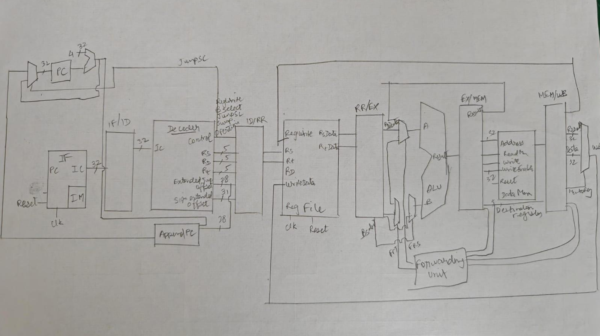
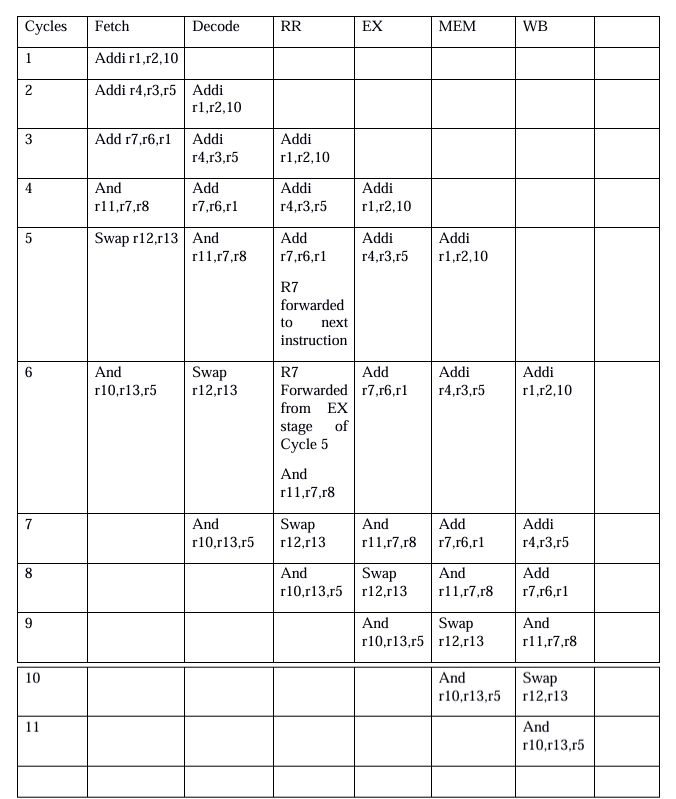
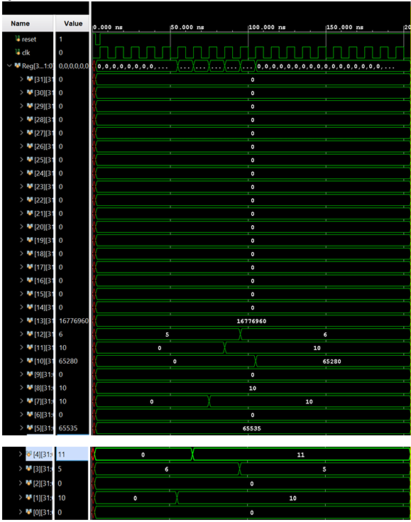
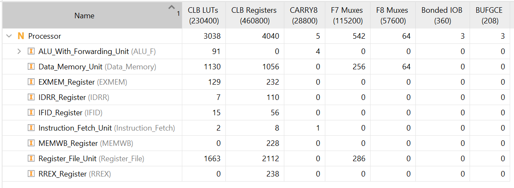

# 6-Stage Pipelined MIPS Processor

## Overview

This project implements a 32-bit 6-stage pipelined MIPS processor in Verilog HDL. The processor supports fundamental MIPS instructions along with a custom SWAP instruction and incorporates data forwarding to mitigate pipeline hazards. The design was functionally verified through simulation and synthesized for FPGA implementation.

### Pipeline Stages

* Instruction Fetch (IF)
* Instruction Decode (ID)
* Register Read (RR)
* Execute (EX)
* Memory Access (MEM)
* Writeback (WB)

---

## Features

* 32-bit MIPS architecture
* 6-stage pipelined datapath
* Data forwarding unit for hazard mitigation
* Custom SWAP instruction implementation
* Register File subsystem
* Instruction Memory and Data Memory
* Dedicated Control Signal Generator
* Pipeline Registers between stages
* FPGA synthesizable RTL design
* Functional verification using Verilog testbench

---

## Processor Datapath

The processor datapath consists of six pipeline stages separated by dedicated pipeline registers. Data hazards are mitigated through a forwarding unit integrated into the execution stage.



---

## Pipeline Execution

The figure below illustrates instruction progression through the six pipeline stages and demonstrates overlapped instruction execution within the pipeline.



---

## Functional Verification

Simulation was performed using a custom Verilog testbench to verify instruction execution, register updates, forwarding behavior, and overall processor functionality.



---

## FPGA Synthesis Results

The design was successfully synthesized for FPGA implementation.

### Resource Utilization

| Resource  | Usage |
| --------- | ----- |
| LUTs      | 3038  |
| Registers | 4040  |
| CARRY8    | 5     |
| F7 Muxes  | 542   |
| F8 Muxes  | 64    |
| IOBs      | 3     |
| BUFGCE    | 3     |



---

## Project Structure

```text
MIPS_Processor/
│
├── rtl/
│   ├── ALU.v
│   ├── ALU_F.v
│   ├── Control_Signal_Generator.v
│   ├── Data_Memory.v
│   ├── EXMEM.v
│   ├── Forwarding_Unit.v
│   ├── IDRR.v
│   ├── IFID.v
│   ├── Instruction_Decode.v
│   ├── Instruction_Fetch.v
│   ├── Instruction_Memory.v
│   ├── Jump_Extender.v
│   ├── MEMWB.v
│   ├── Processor.v
│   ├── Register_File.v
│   ├── RREX.v
│   ├── Sign_Extender.v
│   └── Writeback.v
│
├── verification/
│   └── Processor_TB.v
│
├── docs/
│   ├── datapath.png
│   ├── pipeline_execution.png
│   ├── waveform.png
│   └── synthesis_utilization.png
│
└── README.md
```

---

## Key Learning Outcomes

* RTL design of a pipelined processor
* Pipeline register implementation
* Forwarding path design
* Hazard mitigation techniques
* Control-path and datapath integration
* Functional verification using simulation
* FPGA synthesis and resource analysis

---

## Future Improvements

* Branch hazard handling
* Dynamic branch prediction
* Instruction cache and data cache support
* Expanded MIPS ISA support
* Performance benchmarking
* FPGA hardware validation

```

### Author

**Krithik Harshith**  
BITS Pilani Goa Campus

```
